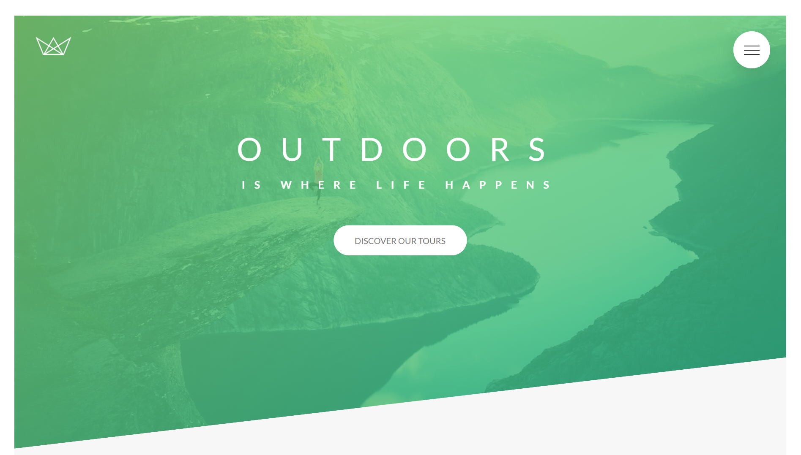

11/26/25, 7:47 PM Google Gemini

🌲 Natours - Outdoors is where life happens

📖 About The Project

Natours is a landing page for a fictional nature tour agency. The primary goal of this project is to demonstrate advanced CSS and Sass techniques without relying on external CSS frameworks like Bootstrap.

It features a modern, responsive design with complex animations, a custom grid system, and a modular architecture.

✨ Key Features

- 7-1 Sass Architecture: Modular file structure (Abstracts, Components, Layout, Pages, etc.) for maintainability.
- Custom Grid System: A lightweight, float-based grid built from scratch using Sass mixins.
- Advanced CSS Animations: Custom keyframe animations, hover effects, and transitions.
- "Checkbox Hack" Navigation: A pure CSS full-screen navigation overlay that functions without JavaScript logic (enhanced with a small JS snippet for UX).
- Responsive Design: Optimized for all device sizes using media queries ( @content manager).
- BEM Methodology: Block Element Modifier naming convention for clean, scalable HTML/CSS.
- Interactive UI: 3D rotating cards, form animations, and modal popups.

🛠 Tech Stack

- HTML5 - Semantic markup.
- CSS3 - Custom properties, 3D transforms, clip-paths.
- Sass (SCSS) - Variables, mixins, nesting, and modular functions.
- JavaScript - Minimal usage (only for smooth scrolling and closing the mobile menu).

📂 Sass Architecture

This project uses the 7-1 Pattern to organize styles:

/sass

|

|– abstracts/

|   |– \_functions.scss    # Calculation logic

|   |– \_mixins.scss       # Media queries, clearing floats |   |– \_variables.scss    # Colors, fonts, grid width

|

|– base/

|   |– \_animations.scss   # @keyframes

|   |– \_base.scss         # Reset, HTML font-size (62.5%) |   |– \_typography.scss   # Headings and font settings

|

|– components/

|   |– \_button.scss       # Button styles

|   |– \_card.scss         # Rotating tour cards

|   |– \_composition.scss  # Image gallery

|   |– \_feature-box.scss  # Icon boxes

|   |– \_form.scss         # Booking inputs

|   |– \_popup.scss        # Modal window

|   |– \_story.scss        # Testimonials

|

|– layout/

|   |– \_footer.scss       # Footer layout

|   |– \_grid.scss         # Grid row/col logic

|   |– \_header.scss       # Hero section

|   |– \_navigation.scss   # Fullscreen menu

|

|– pages/

|   |– \_home.scss         # Homepage specific styles | – main.scss              # Imports all partials

🚀 Getting Started

To run this project locally:

1. Clone the repository

git clone [https://github.com/yourusername/natours.git](https://github.com/youruser

2. Navigate to the folder

cd natours

3. Compile Sass (If developing) If you are making changes to the  .scss files, you need a Sass compiler.
- VS Code: Install "Live Sass Compiler" extension and click "Watch Sass".
- NPM: npm install node-sass --save-dev then run your build script.
4. Open  index.html Simply open the file in your browser to view the site.

👤 Author

[Your Name]

- Github: [@yourusername](https://github.com/yourusername)

🤝 Acknowledgments

- Design and concepts based on the "Advanced CSS and Sass" course by Jonas Schmedtmann.
https://gemini.google.com/app/e8d691ed47c05b67 2/2
